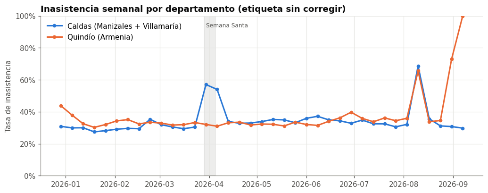
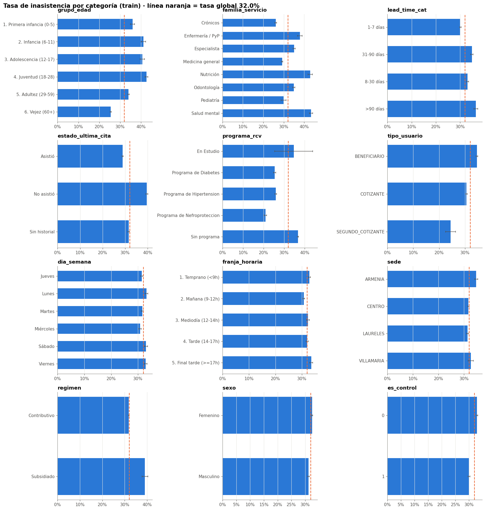
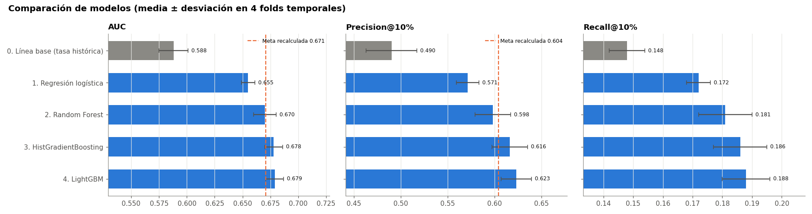
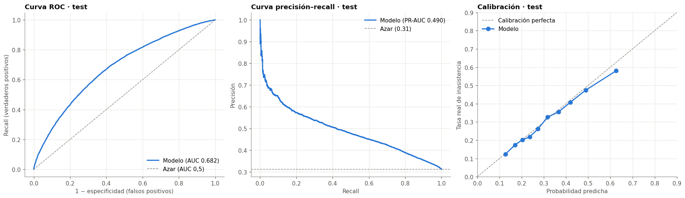
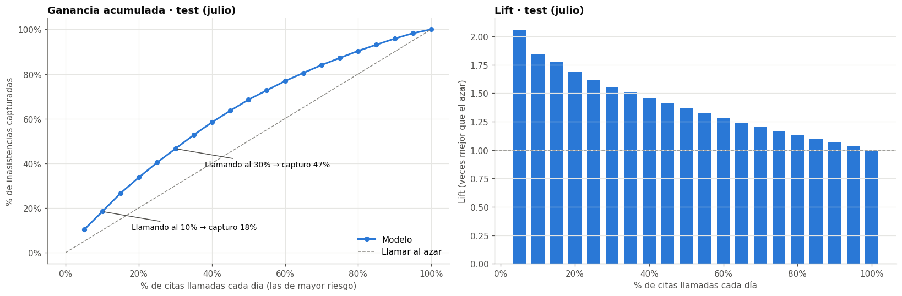
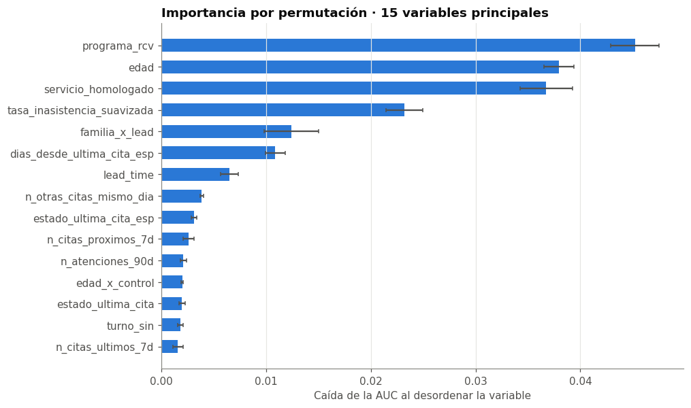
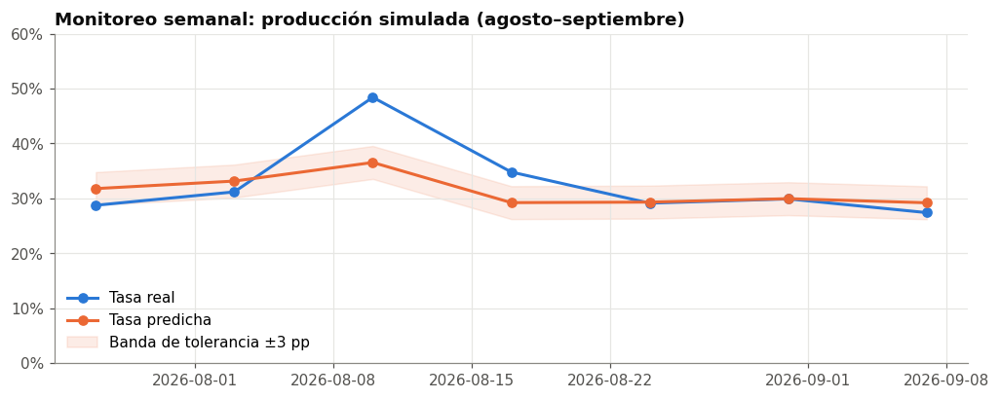

# Modelo predictivo de inasistencia a citas médicas

Especialización en Inteligencia Artificial Aplicada · Análisis de Datos 1

Documentación técnica del proyecto: metodología, decisiones, resultados, limitaciones y recomendaciones

<!-- salto -->

<!-- indice -->

<!-- salto -->

# 1. Resumen ejecutivo

La inasistencia a citas desperdicia cupos de atención y alarga los tiempos de espera. Este proyecto construyó una herramienta que, **el día anterior a las citas**, ordena las citas del día siguiente según su probabilidad de inasistencia. Con esa lista, la IPS puede priorizar las llamadas de confirmación y planear el sobreagendamiento.

**Resultados principales (evaluación única en julio de 2026, datos nunca vistos por el modelo):**

- **Modelo elegido:** LightGBM (gradient boosting), con 45 variables construidas a partir de agendamiento, RIPS, programas de riesgo cardiovascular, gestantes, medicamentos y calendario.
- **AUC = 0,682.** Esto significa que, si se toma al azar una cita a la que el paciente faltó y una a la que asistió, el modelo le da más riesgo a la primera el 68 % de las veces.
- **Precisión en el 10 % de mayor riesgo de cada día: 57,5 %**, frente a 31 % si se llamara al azar (1,8 veces mejor). Llamando al 30 % de mayor riesgo se cubre el 47 % de todas las inasistencias.
- **Probabilidades bien calibradas:** error de calibración de 0,012 en validación y una diferencia entre la tasa predicha y la real de ±1 punto porcentual (pp) por mes. Por eso pueden usarse para planear el sobreagendamiento.
- **Estable en producción simulada:** aplicado a agosto y septiembre (después del entrenamiento), mantuvo una AUC de 0,69.

Un hallazgo central del proyecto fue que **la variable objetivo tenía errores sistemáticos de registro**: días sin reporte en RIPS, procedimientos que no aparecen en el RIPS de consultas, un cambio de codificación de la agenda en abril y citas "huérfanas". Corregirlos bajó las métricas "aparentes" (la AUC pasó de 0,705 a 0,68), pero el modelo resultante mide comportamiento real de los pacientes y no fallas de registro.

# 2. Problema y objetivo

**Problema.** Una parte importante de las citas agendadas no se cumple. Sin anticipar qué citas tienen más riesgo, las acciones de recordatorio se reparten de forma uniforme y el sobreagendamiento se hace a ciegas.

**Objetivo.** Entregar una herramienta que cada día genere la lista de citas de mañana ordenada por probabilidad de inasistencia, respetando cuatro reglas:

1. **Momento de predicción:** el día anterior a la cita (D-1). Ninguna variable usa información de la fecha de la cita o posterior.
2. **Validación temporal:** entrenar con el pasado y evaluar con el futuro; nunca con una partición aleatoria.
3. **Test único:** julio de 2026 se usa una sola vez, al final.
4. **Superar la meta de referencia**, recalculada sobre la etiqueta limpia (ver sección 5.1).

# 3. Datos

| Fuente | Registros | Uso |
|---|---|---|
| agendamiento.xlsx | 576.252 citas | Base: una fila por cita agendada |
| RIPS.xlsx | 290.150 atenciones (consultas, 02-ene a 12-sep-2026) | Variable objetivo (asistencia) e historial clínico |
| RCV.xlsx | 21.003 pacientes | Programa de riesgo cardiovascular |
| Gestantes.xlsx | 784 registros de FUM | Gestante activa en la fecha de la cita |
| Medicamentos.xlsx | 175.948 fórmulas | Número de medicamentos en los 90 días previos |
| DimCalendario_Colombia_2026 | 365 días | Festivos, puentes, inicio y fin de mes |

**Dataset final:** 337.375 citas de 66.306 pacientes, con 45 variables. Partición temporal:

| Partición | Periodo | Citas | Inasistencia |
|---|---|---|---|
| Entrenamiento | 02-ene a 31-may | 211.402 | 32,0 % |
| Validación | junio | 38.719 | 33,5 % |
| Test | julio | 41.148 | 31,2 % |
| Producción simulada | 01-ago a 11-sep | 46.106 | 30,6 % |

# 4. Metodología

## 4.1 Momento de predicción y prevención de fuga de información

El modelo se usa en D-1. En ese momento:

- Las citas asignadas para el mismo día (lead time = 0) todavía no existen, así que se excluyen de la población.
- Lo que ocurre en D-1 aún no se conoce. Por eso el historial, los medicamentos y los diagnósticos se calculan **solo con información hasta D-2**, usando `pd.merge_asof` ("el último valor conocido antes de una fecha"). Una prueba automática verifica que ninguna cita use información a menos de 2 días.
- No se usa el diagnóstico de la cita (`dx_ppal`), que solo existe si el paciente asistió.

Todas las funciones de limpieza y de variables están en un solo módulo (`funciones_inasistencia.py`), que usan tanto el entrenamiento como la herramienta diaria. En la prueba, las variables calculadas en producción coincidieron con las de entrenamiento en 99,5–100 % de los casos, y las probabilidades en 0,9999 de correlación (verificado en dos fechas de prueba).

## 4.2 Construcción y auditoría de la variable objetivo

La agenda no dice si el paciente asistió. Se considera que asistió si RIPS tiene una atención del **mismo paciente, el mismo día y el mismo servicio** (los dos últimos dígitos del código CUPS: 890**2**01 / 890**3**01 = medicina general). La relación entre especialidad y servicio se aprendió de los días sin ambigüedad (1 cita y 1 atención).

La auditoría (Fase 1) encontró y corrigió siete fuentes de error:

| Tema | Hallazgo | Decisión |
|---|---|---|
| Pico de abril | Falla de reporte en RIPS, no Semana Santa: Armenia no cambió y el volumen de RIPS cayó de ~1.600 a menos de 250 atenciones diarias | Excluir días-departamento con asistencia anómala (z robusto < −4). Se detectaron 24: 28-feb, 1–7 abr, 13-jul, 10–15 ago y Armenia 2–11 sep |
| PyP–Enfermería | Desde abril agenda sobre todo procedimientos (ECG, citología), que no están en el RIPS de consultas | Clasificar cada cita como Consulta o Procedimiento y excluir los procedimientos |
| Terapias y servicios no reportados | Asistencia < 25 % (fisioterapia, fonoaudiología, terapias respiratoria y ocupacional, higiene oral); auxiliar de salud oral con registro inestable | Excluir |
| Cambio de codificación (abril) | Crónicos, salud mental, salud pública, etc. pasan a codificarse como procedimiento dentro de medicina general / PyP | Crear un *servicio homologado* (especialidad + procedimiento agendado) |
| Citas huérfanas | Las citas que quedaron con el código viejo después de abril casi nunca aparecen en RIPS (2,8 % de asistencia vs. 64 %) | Excluir los 13 códigos descontinuados desde el 1 de abril |
| Reprogramaciones | La IPS no dispone de un reporte de canceladas | Una cita sin atención en RIPS se considera reprogramada si el paciente pidió otra del mismo servicio antes de su fecha. Se excluye |
| Rezago de RIPS | No hay rezago sistemático (relación RIPS/agenda estable) | Se usan datos hasta el 11-sep. Agosto y septiembre sirven como producción simulada |

**Efecto de cada regla sobre el número de citas:**

| Paso | Citas | Eliminadas |
|---|---|---|
| Agendamiento original | 576.252 | — |
| Sin duplicados exactos | 574.730 | 1.522 |
| Con fecha de asignación, especialidad y hora | 567.212 | 7.518 |
| Una cita por paciente-día-servicio | 516.498 | 50.714 |
| Dentro de la ventana con RIPS | 483.541 | 32.957 |
| Asignadas al menos 1 día antes | 442.516 | 41.025 |
| Solo consultas (sin procedimientos) | 399.008 | 43.508 |
| Sin terapias ni servicios no reportados | 381.955 | 17.053 |
| Sin citas huérfanas | 378.598 | 3.357 |
| Sin días sin reporte en RIPS | 359.677 | 18.921 |
| Sin posibles reprogramaciones | 337.375 | 22.302 |

## 4.3 Variables

| Grupo | Variables principales |
|---|---|
| Agendamiento | lead time (días y rangos), hora (cíclica y franja), primera vez / control, servicio homologado, familia de servicio |
| Sociodemográficas | edad y curso de vida (Res. 3280/2018), sexo, nivel y tipo de usuario, régimen, sede |
| Calendario | día de la semana, festivos, días previos y posteriores a festivo, puentes, primer día hábil del mes |
| Historial (hasta D-2) | citas previas, inasistencias previas, tasa histórica suavizada, estado de la última cita, días desde la última cita, sin historial |
| Historial por servicio | lo mismo, pero solo en el servicio de la cita |
| Clínicas (hasta D-2) | programa RCV, diabetes, gestante activa, medicamentos en 90 días, diagnósticos CIE-10 previos, atenciones en 90 días |
| Carga de agenda | otras citas el mismo día y en los 7 días anteriores y siguientes (ya agendadas en D-1) |
| Interacciones | familia de servicio × lead time, curso de vida × tipo de cita |

La **tasa histórica suavizada** resuelve el "arranque en frío": parte del promedio general de entrenamiento y se acerca a la tasa propia del paciente a medida que acumula citas, con la fórmula (inasistencias + 3 × promedio) / (citas + 3).

## 4.4 Análisis exploratorio (solo con datos de entrenamiento)

| Hipótesis | Resultado | Efecto | Veredicto |
|---|---|---|---|
| Más lead time → más inasistencia | 36,5 % (>90 días) vs. 30,1 % (1–7 días) | Moderado (6,4 pp), inestable en junio | Se confirma |
| Los jóvenes faltan más | 42,7 % (18–28 años) vs. 25,5 % (60+) | Grande (17,2 pp) | Se confirma |
| Los crónicos faltan menos | 24,6 % (programas RCV) vs. 36,7 % (sin programa) | Grande (12,1 pp) | Se confirma |
| Lunes y sábado → más inasistencia | 33,1 % vs. 31,6 % | Pequeño (1,5 pp) | Se confirma |
| Puentes festivos → más inasistencia | 35,9 % vs. 32,0 % | Moderado (3,9 pp), solo el 1,7 % de las citas | Se confirma |

Otras conclusiones: faltar a la última cita eleva la inasistencia (39,6 % vs. 28,9 %). Las relaciones de persona e historial (edad, programa, tipo de usuario, estado de la última cita) son estables mes a mes, mientras que las de agenda y calendario (lead time, día, hora, sede) son pequeñas e inestables. Se eliminaron 12 variables redundantes (correlación de Spearman > 0,8), sin señal o con codificación inestable.

## 4.5 Medidas técnicas y selección de variables

- **Validación cruzada temporal** con ventana creciente (ene–feb → mar, …, ene–may → jun). La validación aleatoria sobreestimó la AUC (0,682 vs. 0,668) porque "ve el futuro".
- **Estandarización:** necesaria para la regresión logística. Sin ella, el optimizador no converge en 3.000 iteraciones; con ella, converge en unas 100. No es necesaria para los árboles.
- **Regularización:** en la logística casi no cambia la AUC (hay datos de sobra), pero se mantiene para estabilizar los coeficientes. En los árboles se ajusta con los hiperparámetros.
- **Variables v2 por bloques:** entraron el historial por servicio (+0,0025 de AUC), la carga de agenda (+0,0054) y las interacciones (+0,0027 en la logística). Las reprogramaciones previas no aportaron y no entraron.
- **Desbalance (32 %):** `class_weight="balanced"` no mejoró el ordenamiento y **infló las probabilidades** (48 % predicho vs. 34 % real). No se balanceó ni se usó SMOTE.
- **Calibración:** la calibración isotónica empeoró el Brier y la AUC. El modelo ya estaba bien calibrado, así que no se calibró.

## 4.6 Métricas de negocio

Se supone una capacidad de llamadas equivalente al **10 % de las citas diarias** (~180 de ~1.800), más un escenario del 30 % con mensajes automáticos. Por eso la métrica principal es la **precisión en el top 10 % de cada día**, y se complementa con recall, especificidad, F1, AUC, PR-AUC y Brier.

Con los supuestos de costo (cupo perdido de $45.000, llamada de $2.500 y 25 % de efectividad de la llamada), llamar es rentable desde un riesgo del 22 %. El límite real es, entonces, la capacidad y no el costo. Estos supuestos están en `modelos/config_negocio.json` y deben reemplazarse por los valores reales de la IPS.

# 5. Resultados

## 5.1 Comparación de modelos (validación cruzada temporal, enero–junio)

La meta original (AUC 0,705) se midió con la etiqueta sin corregir. Con el mismo protocolo sobre la etiqueta limpia, la **meta recalculada es AUC 0,671 y precisión@10 % de 60,4 %**.

| Modelo | AUC | PR-AUC | Brier | Precisión@10% | Recall@10% | Especificidad@10% | F1@10% |
|---|---|---|---|---|---|---|---|
| Línea base (tasa histórica) | 0,588 ± 0,013 | 0,413 | 0,220 | 0,490 | 0,148 | 0,924 | 0,227 |
| Regresión logística | 0,655 ± 0,006 | 0,480 | 0,234 | 0,571 | 0,172 | 0,936 | 0,265 |
| Random Forest | 0,670 ± 0,010 | 0,506 | 0,203 | 0,598 | 0,181 | 0,940 | 0,277 |
| HistGradientBoosting | 0,678 ± 0,008 | 0,514 | 0,201 | 0,616 | 0,186 | 0,943 | 0,286 |
| **LightGBM** | **0,679 ± 0,008** | **0,517** | **0,201** | **0,623** | **0,188** | **0,944** | **0,289** |

LightGBM y HistGradientBoosting son equivalentes: su diferencia está dentro de la variación entre folds. Se eligió LightGBM por su AUC media más alta y su velocidad. Ambos superan la meta recalculada.

## 5.2 Evaluación única en test (julio de 2026)

| Métrica | Validación cruzada | Test (julio) |
|---|---|---|
| AUC | 0,679 | **0,682** |
| PR-AUC | 0,517 | 0,490 |
| Brier | 0,201 | 0,196 |
| Precisión@10% | 0,623 | 0,575 |
| Recall@10% | 0,188 | 0,184 |
| Especificidad@10% | 0,944 | 0,938 |
| Precisión@30% | 0,505 | 0,485 |
| Recall@30% | 0,458 | 0,465 |
| Especificidad@30% | 0,778 | 0,776 |

La AUC en test es igual a la de validación, así que **no hay sobreajuste**. La precisión baja un poco porque julio tuvo menos inasistencia (31,2 %), y la precisión depende de la tasa base.

| Capacidad diaria | Inasistencias capturadas | Precisión | Lift | Beneficio neto en julio (supuestos) |
|---|---|---|---|---|
| 5 % | 10,2 % | 64,3 % | 2,06 | $9,7 millones |
| 10 % | 18,4 % | 57,5 % | 1,84 | $16,3 millones |
| 20 % | 33,7 % | 52,6 % | 1,69 | $28,1 millones |
| 30 % | 46,5 % | 48,5 % | 1,55 | $36,5 millones |

## 5.3 Equidad

Entre sedes, regímenes y sexos, la AUC (0,68 ± 0,01) y la calibración (brecha ≤ 2,3 pp) son parecidas. Por curso de vida, la AUC dentro de cada grupo es menor (0,62–0,66), algo esperable al comparar pacientes parecidos entre sí, pero la calibración es buena (≤ 3,2 pp). El único grupo con una brecha relevante es **Especialistas: el modelo predice 29,8 % y la tasa real es 23,7 %**. Coincide con la tendencia a la baja de algunas especialidades (dermatología) y se corrige con reentrenamientos periódicos.

## 5.4 Interpretabilidad

Las diez variables más influyentes (importancia por permutación en validación):

| # | Variable | Interpretación |
|---|---|---|
| 1 | programa_rcv | Los pacientes de programas crónicos son más cumplidos |
| 2 | edad | Jóvenes (12–28) faltan más; adultos mayores, menos |
| 3 | servicio_homologado | Salud mental y nutrición faltan más; crónicos y medicina general, menos |
| 4 | tasa_inasistencia_suavizada | Quien ha faltado antes, tiende a volver a faltar |
| 5 | familia_x_lead | El efecto del tiempo de espera depende del servicio |
| 6 | dias_desde_ultima_cita_esp | Los pacientes frecuentes en el servicio son más cumplidos |
| 7 | lead_time | Más días entre la asignación y la cita, más riesgo |
| 8 | n_otras_citas_mismo_dia | Quien viene a varias citas el mismo día suele asistir |
| 9 | estado_ultima_cita_esp | Faltar a la última cita del mismo servicio eleva el riesgo |
| 10 | n_citas_proximos_7d | Otras citas en la semana siguiente (tratamiento activo) |

**Errores del modelo.** Los falsos negativos (faltaron, pero el modelo les dio riesgo bajo) son pacientes algo mayores y con buen historial: son inasistencias ocasionales, difíciles de anticipar por naturaleza. El desempeño es menor en pacientes sin historial (AUC de 0,64 vs. 0,68).

## 5.5 Monitoreo en producción simulada

| Mes | Citas | Tasa real | Tasa predicha | AUC | Precisión@10% | Estado |
|---|---|---|---|---|---|---|
| Julio (test) | 41.148 | 31,2 % | 32,3 % | 0,682 | 57,5 % | OK |
| Agosto | 30.350 | 31,6 % | 30,6 % | 0,692 | 60,9 % | OK |
| Septiembre (1–11) | 15.756 | 28,8 % | 29,6 % | 0,694 | 57,5 % | OK |

# 6. Herramienta predictiva

**Uso diario (el día anterior a las citas):**

- Desde la terminal: `python prediccion_diaria.py --fecha AAAA-MM-DD`
- Con interfaz web: `streamlit run app_streamlit.py`

**Qué hace:** carga el modelo guardado (`modelos/modelo_inasistencia.joblib`). Usa solo la información disponible en D-1 (agenda asignada hasta D-1; RIPS y medicamentos hasta D-2) y calcula las variables con las mismas funciones del entrenamiento. Luego genera `salidas/prediccion_AAAA-MM-DD.xlsx` con tres hojas:

- **Resumen:** citas evaluadas, riesgo alto y medio, inasistencias esperadas.
- **Prioridad de llamadas:** citas ordenadas por probabilidad, con nivel de riesgo (Alto = 10 % de mayor riesgo del día, Medio = siguiente 20 %, Bajo = resto) y motivos en lenguaje sencillo (por ejemplo, "Faltó a su última cita").
- **No evaluadas:** procedimientos, terapias y códigos descontinuados, con el motivo.

**Ejemplo (27 de agosto de 2026):** 1.834 citas evaluadas. La inasistencia real fue de 70,5 % en las de riesgo Alto, 43,3 % en las de Medio y 27,6 % en las de Bajo.

**Protocolo de monitoreo:**

| Frecuencia | Qué revisar | Umbral | Acción |
|---|---|---|---|
| Semanal | Tasa real vs. predicha | Brecha > 3 pp durante 2 semanas | Verificar primero el reporte de RIPS; si los datos están bien, recalibrar |
| Mensual | AUC y precisión@10% | Caída de la AUC > 0,03 vs. test | Reentrenar |
| Mensual | Calibración por subgrupo | Brecha > 5 pp | Analizar el grupo (hoy: especialistas) |
| Mensual | Reentrenamiento programado | — | Reentrenar con todos los meses etiquetados, previa auditoría (notebook 01) |

# 7. Limitaciones

- **Cancelaciones:** sin un reporte de canceladas, una cancelación sin nueva cita se cuenta como inasistencia, así que la tasa de inasistencia puede estar sobreestimada.
- **RIPS de consultas:** los procedimientos y las terapias no se pueden evaluar, porque su asistencia no aparece en el RIPS disponible.
- **Horizonte corto:** con ocho meses de datos no se puede aprender estacionalidad anual, y el historial arranca en enero (arranque en frío).
- **Variables no disponibles:** no hay dirección del paciente, hospitalizaciones, cirugías ni canal de agendamiento. RCV no tiene fechas y se asume que el programa estuvo vigente en todo el periodo.
- **Residuos de registro:** Armenia del 13 al 15 de agosto tuvo un reporte parcial que la regla estadística no detectó (unas 600 citas).
- **Supuestos de negocio:** los costos y la efectividad de la llamada son supuestos de referencia.
- **Techo del modelo:** con datos administrativos y esta etiqueta, el comportamiento individual se predice solo parcialmente (AUC ≈ 0,68).

# 8. Recomendaciones de datos para la IPS

1. **Registrar el estado de cada cita** (cumplida, cancelada por el paciente, cancelada por la IPS, reprogramada, inasistencia) en el sistema de agendamiento. Es la mejora más importante: elimina el ruido de la etiqueta y permite medir la inasistencia en tiempo real, sin depender de RIPS.
2. **Incluir el RIPS de procedimientos**, para evaluar citologías, electrocardiogramas y terapias.
3. **Documentar los cambios de codificación de la agenda** (como el de abril de 2026) y mantener una tabla de equivalencias entre códigos viejos y nuevos.
4. **Agregar variables de contacto:** canal de agendamiento, si se envió recordatorio y si el paciente lo confirmó. Además de mejorar el modelo, permite medir el efecto real de las llamadas.
5. **Agregar la dirección o el barrio del paciente**, para estimar la distancia a la sede.
6. **Registrar las fechas de ingreso y salida de los programas RCV.**
7. **Evaluar el impacto con un piloto controlado:** comparar la inasistencia de citas de riesgo alto llamadas vs. no llamadas, para medir la efectividad real (hoy supuesta en 25 %).

# 9. Estructura del proyecto y reproducibilidad

| Archivo | Contenido |
|---|---|
| 01_Auditoria_Etiqueta.ipynb | Fase 1: auditoría de la variable objetivo |
| 02_Construccion_Dataset.ipynb | Construcción de `dataset_modelo.parquet` |
| 03_EDA.ipynb | Fase 2: análisis exploratorio orientado a hipótesis |
| 04_Metricas_y_Variables_v2.ipynb | Fases 3 y 4: métricas de negocio, medidas técnicas y variables v2 |
| 05_Modelado.ipynb | Fase 5: modelado progresivo y búsqueda de hiperparámetros |
| 06_Evaluacion_Final.ipynb | Fases 6 a 8: test, equidad, interpretabilidad, modelo de producción y monitoreo |
| funciones_inasistencia.py | Funciones de limpieza, etiqueta y variables (compartidas) |
| funciones_modelado.py | Validación temporal, métricas y modelos |
| prediccion_diaria.py / app_streamlit.py | Herramienta diaria (terminal e interfaz web) |
| modelos/ | Modelo entrenado, variables, parámetros y configuración de negocio |
| dataset_modelo.parquet / dataset_modelo_v2.parquet | Datasets de modelado |
| diccionario_variables.csv | Descripción de cada variable |

**Para reproducir:** ejecutar los notebooks en orden (01 a 06) con el entorno Anaconda base (pandas 2.3, scikit-learn 1.7, LightGBM 4.7). Todos los parámetros están en `funciones_inasistencia.PARAMETROS`.
